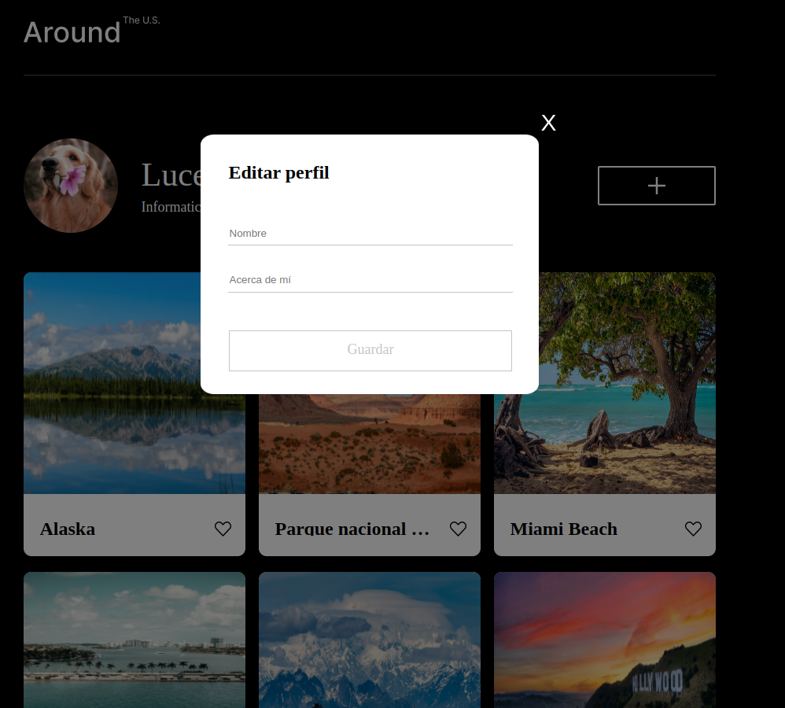

# Tripleten web_project_around

## Lucero Villafuerte

Estudiante de software en Tripleten

## Descripción

Se muestra un perfil con el botón de editar, el cual despliega un popup permitiendo modificar los campos nombre y profesión.

## Pagina

https://lucerovs.github.io/web_project_around/

### 🎥 Simple demo

  

  

### 🧰 Version Control

|                                                        Technology Icon                                                        | Technology Name | URL                                                                                                     |
| :---------------------------------------------------------------------------------------------------------------------------: | :-------------: | ------------------------------------------------------------------------------------------------------- |
|  |       Git       | `https://user-images.githubusercontent.com/25181517/192108372-f71d70ac-7ae6-4c0d-8395-51d8870c2ef0.png` |
|  |     GitHub      | `https://user-images.githubusercontent.com/25181517/192108374-8da61ba1-99ec-41d7-80b8-fb2f7c0a4948.png` |

### 🔨 Tools

|                                                        Technology Icon                                                        |  Technology Name   | URL                                                                                                     |
| :---------------------------------------------------------------------------------------------------------------------------: | :----------------: | ------------------------------------------------------------------------------------------------------- |
|  | Visual Studio Code | `https://user-images.githubusercontent.com/25181517/192108891-d86b6220-e232-423a-bf5f-90903e6887c3.png` |

### 🌐 Web Dev

|                                                        Technology Icon                                                        | Technology Name | URL                                                                                                     |
| :---------------------------------------------------------------------------------------------------------------------------: | :-------------: | ------------------------------------------------------------------------------------------------------- |
|  |      HTML       | `https://user-images.githubusercontent.com/25181517/192158954-f88b5814-d510-4564-b285-dff7d6400dad.png` |
|  |       CSS       | `https://user-images.githubusercontent.com/25181517/183898674-75a4a1b1-f960-4ea9-abcb-637170a00a75.png` |
|  |   JavaScript    | `https://user-images.githubusercontent.com/25181517/117447155-6a868a00-af3d-11eb-9cfe-245df15c9f3f.png` |
